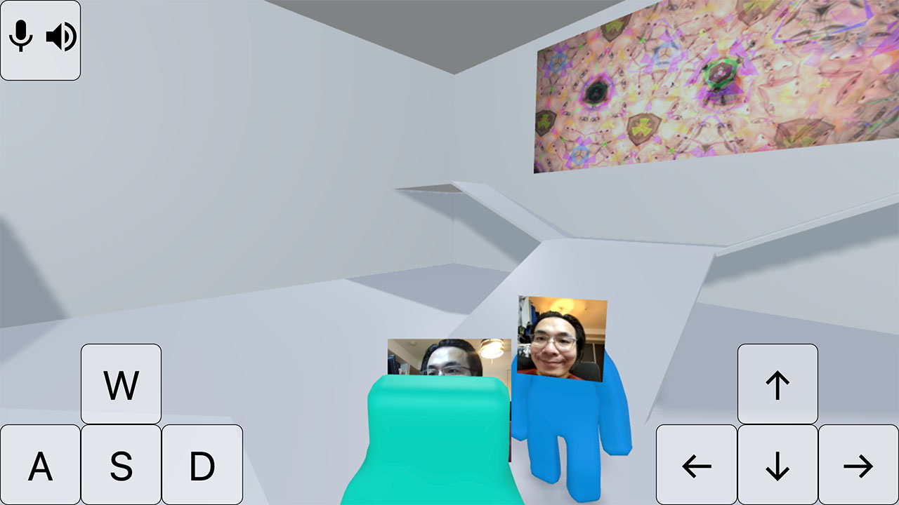
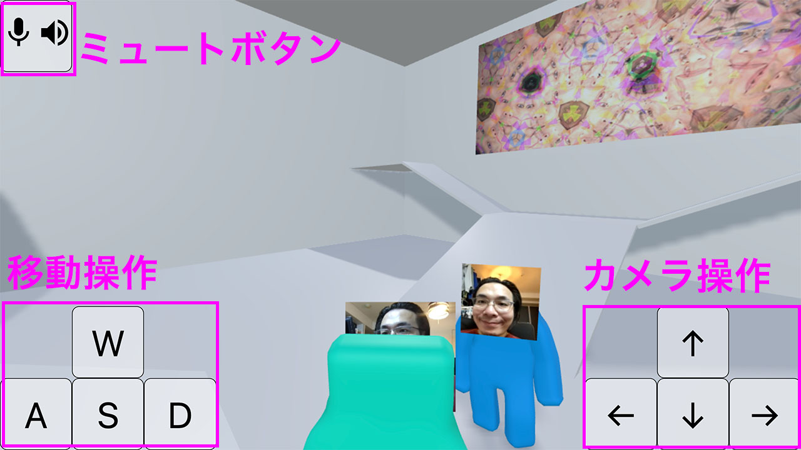

# 顔 to 顔

## 作品の説明
顔と顔を合わせることがなくなりました。<br>
Web会議は大勢から正面から見つめられている気がして苦手です。<br>
バーチャル空間で少人数で顔と顔を合わせられるようにしました。

この作品では、近くにいる人の声が大きく聞こえます。<br>
落ち着いて話したい時は近づきましょう。<br>
うるさい声や、聞きたくない話からは離れましょう。

「顔 to 顔」の読み方は「カオ トゥ カオ」です。



パソコン（以下PC）とスマートフォン（以下SP）に対応しています。

<div style="page-break-before:always"></div>

## 操作方法

移動操作とカメラ操作は長押しして操作します。

SPはタップに対応しています。<br>
PCの場合はクリックのほかに、キーボードのWASDと矢印キーに対応しています。



## 技術的な説明
WebRTCとWebSocketとWebGLを使っています。

socket.io（WebSocket）でバーチャル空間の情報とWebRTCのシグナリングを制御しています。

WebRTCでビデオチャットの機能を実現しています。

three.js（WebGL）でバーチャル空間を構築し、立体音響の機能も使っています。

Dockerで環境構築の再現性を担保しました。

<div style="page-break-before:always"></div>

## 環境構築

### .envの作成
自分のTURNサーバー（coturnコンテナ）を指定しておく
localhostの場合relayが動作しない点に注意。relayが動かなくても開発には問題なし。
```
TURN_SERVER_URI="turn:example.com:3478"
TURN_SERVER_USER="user"
TURN_SERVER_PASSWORD="password"

```


### 開発環境
+ Mac（Intel）
+ Docker for Desktop（Docker Composeも入る）
+ nodenv


### 本番環境

#### インフラ
インターネットからアクセスできるLinuxサーバーを準備する（たとえばEC2 AmazonLinux2 t2.micro）<br>
以下のポートを開放する<br>
22 80 443 3000 3478/tcp 3478/udp 49160-49200/udp

#### ソフトウェア

+ Docker
+ Docker Compose
+ nginxによるリバースプロキシ
  + 80 -> 3000
+ certbotによるnginxのssl化
  + 443 -> 3000 が自動的に追加される

<div style="page-break-before:always"></div>

## 実行

### ビルド
```
$ docker-compose build
```

### 開始
```
$ docker-compose up -d
```

### 終了
```
$ docker-compose down
```

## デバッグ実行

### ビルド
```
$ ./docker-compose-develop.sh build
```

### 開始
```
$ ./docker-compose-develop.sh up -d
```

### 終了
```
$ ./docker-compose-develop.sh down
```

